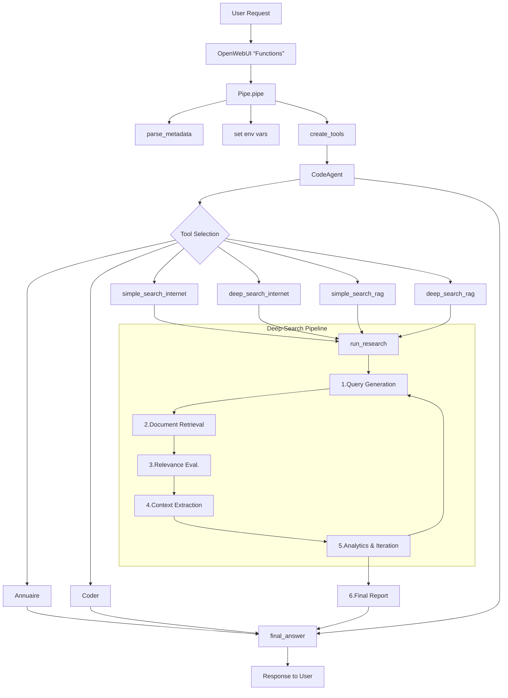

# Agent "Bob"

## 1. Introduction

Bob is a code agent (built with smolagents) that:  
- Reads user tasks
- Decides whether to answer directly, search the internet or a RAG
- Combines results into a final markdown answer

He “thinks” via Thought: comments, writes code in Code: blocks, inspects outputs in Observation:, then emits a final answer via final_answer(...).

## 2. Architecture Overview

- CodeAgent (from smolagents): orchestration engine with a system prompt
- create_tools(...): function to instanciate the tools (deep_search_internet, simple_search_internet, simple_search_rag, deep_search_rag)
- run_research(): core async research pipeline used by the deep-search tools
- open-webui.retrieval & Albert API: handles vector searches and RAG for default RAG or Albert RAG
- Brave Search API: quick web searches

## 3. Environment & Dependencies

- Python 3.10+
- asyncio, aiohttp, requests, BeautifulSoup4, uvloop, smolagents
- Environment variables in .env:
  - BRAVE_KEY → web search API key
- Environment variables (Valves) on the frontend:
  - ALBERT_URL, ALBERT_KEY → your RAG-server endpoint
  - COLLECTIONS → comma-separated RAG collection names
  - DESCRIPTION → description of the collections
  - SUPERVISOR_MODEL → The agent, LLM model name on the Albert API
  - REDACTOR_MODEL, ANALYTICS_MODEL, DEFAULT_MODEL → LLM model names on the Albert API
  - MESSAGES_MEMORY → number of messages in agent memory

## 4. Tools

### 4.1 simple_response

- When: trivial Q&A, no search
- How: calls model_func with the user query

### 4.2 coder

- When: user wants Python code generated
- How: wraps model_func

### 4.3 simple_search_internet

- When: quick web lookup
- Config:
  - internet=True
  - iteration_limit=2, num_queries=1, k=2, max_tokens=400
  - lightweight prompt ("réponse courte et concise")

### 4.4 deep_search_internet

- When: complex internet research
- Config:
  - internet=True
  - iteration_limit=2, num_queries=3, k=3, max_tokens=2048
  - full deep-search pipeline

### 4.5 simple_search_rag

- When: single RAG lookup (administrative)
- Config:
  - internet=False, collections=[…]
  - single query, concise prompt + sources

### 4.6 deep_search_rag

- When: multi-step RAG research
- Identical pipeline to deep_search_internet but over internal collections/Albert RAG

## 5. Deep-Search Pipeline (run_research)

1. Query Generation
   - If no prior contexts:
     - Call generate_search_queries_async → up to 2–3 Google-style queries (via LLM).
2. Document Retrieval
   - Internet: perform_brave_search_async → Brave API → URLs → fetch pages.
   - RAG: search_api_albert → Albert vector search → document chunks.
3. Relevance Evaluation
   - is_page_useful_async → LLM evaluator ("oui"/"non").
4. Context Extraction
   - extract_relevant_context_async → LLM extractor per page → concise snippet.
5. Analytics & Iteration
   - get_new_search_queries_async → checks if more queries needed (empty contexts or LLM suggests new queries).
   - Loop until iteration_limit or LLM returns [].
6. Final Report
   - generate_final_report_async → LLM redactor → full markdown answer with [1]…[n] references.
   - Tracks tokens via TokenCounter, logs timings & citations via event_emitter.

## 6. deep_search Tool System Tree
```
deep_search_*  
├─ run_research()  
│   ├─ async_research()  
│   │   ├─ loop(iterations)  
│   │   │   ├─ generate_search_queries_async  
│   │   │   ├─ process_query_api()  
│   │   │   │   ├─ search_api_albert OR perform_brave_search_async  
│   │   │   │   ├─ is_page_useful_async (filter)  
│   │   │   │   └─ extract_relevant_context_async  
│   │   │   ├─ get_new_search_queries_async  
│   │   │   └─ accumulate contexts  
│   │   └─ generate_final_report_async  
│   └─ TokenCounter & logging  
└─ Tools expose run_research with different flags  
```
## 7. Minimal Usage Examples

### 1. Simple web search
answer = simple_search_internet("Quel est l'âge de la retraite en France ?")
print(answer)

### 2. Deep administrative RAG search
report = deep_search_rag("Je suis handicapé à 80% et né en 1972, à quelle age puis-je prendre ma retraite ?")
print(report)

### 3. Code generation
snippet = coder("Écris une fonction Python pour calculer la factorielle de x.")
print(snippet)

## 8. Front-End Integration (OpenWebUI “Functions”)

The script `agent_function.py` is pasted into the OpenWebUI "Functions" panel, where each incoming chat message is handled by the Pipe. In brief, it:

- Parses any attached files or collections (parse_metadata)
- Sets up environment variables (models, API keys, collections…)
- Imports create_tools & the system prompt template
- Builds the toolset (deep/search RAG, simple search, coder, etc.)
- Instantiates a CodeAgent with the customized prompt and tools
- Streams intermediate “Thought”/“Code” blocks back via the event emitter
- Emits the final answer through final_answer()

## Diagram of the pipeline



# Observed issues

## Streaming issues
Using the built-in event emitter to stream intermediate “Thought”/“Code” blocks back to the frontend is not working in a streaming way. 
The DeepSearch tool being async, streaming intermediate steps using the event emitter is not working as expected, as every intermediate event will only be sent after the final answer is generated. 
Event emitter is used in the DeepSearch tool anyway to be able to show the chunks for the RAG part, but intermediate steps can't be streamed.

links may link to the issue: 
- https://github.com/huggingface/smolagents/issues/334
- https://github.com/open-webui/open-webui/discussions/8461#discussioncomment-12555203
- https://github.com/open-webui/pipelines/issues/225

## Timeout
When the agent takes too long to answer, the request will likely be cancelled by the server and not be displayed on the frontend even if the agent manage to generate an answer.

## Sources handling
When using RAG, the agent is prompted to insert its sources at the end of its answer, but sometime names and urls of sources are not correctly displayed and may be mixed up.
Likewise, sources detected by the openwebui front are sometimes mixed up as well.

### Potential solutions:
- Standardize the source format with clear delimiters between name and URL
- Implement a post-processing step to validate and correct source formatting
- Investigate the source parser on the frontend and see how it works